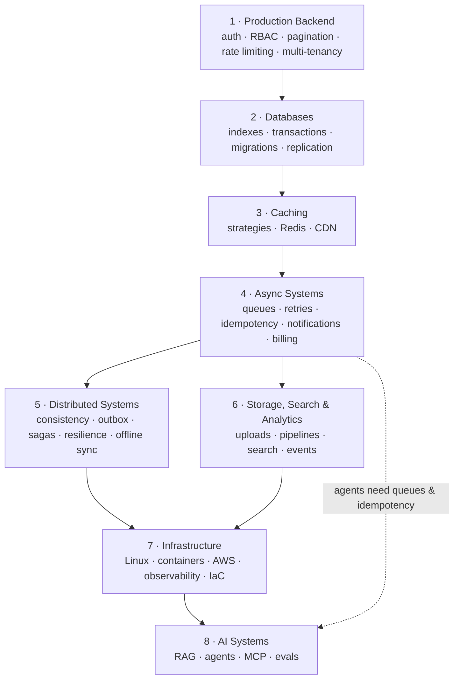
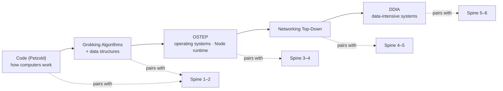
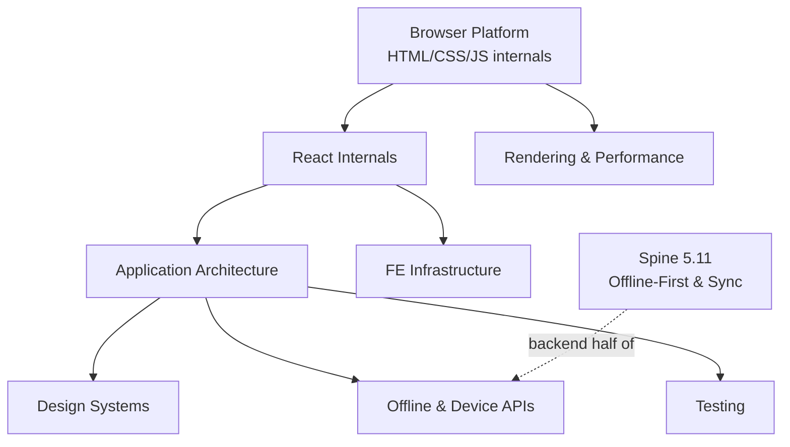

# Dependency Graph

What unlocks what. Edges mean "genuinely easier if you've done the source first" —
not bureaucratic gating. `must`-tier modules within a stage are the real gate;
`should`/`nice` can be back-filled any time.

## Spine stages

## Foundations pairing (read alongside, not before)

## Frontend track entry points

**Interview-priority path** (senior FE roles, relevant now):
JavaScript Internals → Rendering & Reconciliation → Browser Rendering Pipeline → Frontend Performance.

## Cross-track edges worth knowing

| Before | Makes this much easier |
|---|---|
| OSTEP concurrency primitives | Background jobs & workers (Spine 4.1) |
| Node.js runtime internals | Realtime/WebSockets, streams, backpressure everywhere |
| Networking: TCP & HTTP | Rate limiting, load balancing, WebSockets, K8s networking |
| DDIA replication/partitioning | Spine 5 (distributed systems) — read them together |
| Queues + idempotency (Spine 4) | Billing, webhooks, agents (tool retries are retries) |
| Storage engines (DDIA ch. 3) | Indexes & query optimization (Spine 2.2) |
| Hash tables + LRU (Foundations 2) | Caching stage — you'll have built the core structure |
